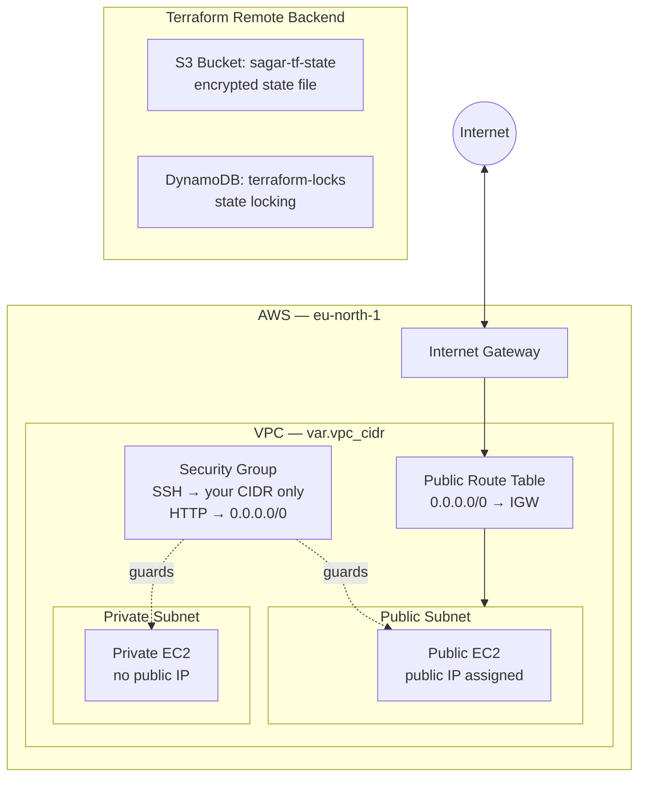

# AWS Network Infrastructure with Terraform


Modular Terraform that provisions a foundational AWS network from scratch: a VPC, public and private subnets, an internet gateway with routing, a security group, and two EC2 instances. State is stored remotely in **S3** and protected against concurrent runs with a **DynamoDB lock table**.

The whole stack is broken into small, reusable modules so the `dev` environment is just wiring — and adding a `staging` or `prod` environment later is a matter of a new `tfvars` file, not new resource code.

## Architecture



Traffic from the internet reaches the **public subnet** through the internet gateway via a route table that sends `0.0.0.0/0` to the IGW. The **private subnet** is deliberately left off that route table, so the private instance has no inbound or outbound internet path — see [Design decisions](#design-decisions--known-limitations) for why.

## What it provisions

- A **VPC** with DNS hostnames and DNS support enabled
- One **public subnet** (auto-assigns public IPs) and one **private subnet**
- An **internet gateway** attached to the VPC
- A **public route table** (`0.0.0.0/0` → IGW) associated with the public subnet
- A **security group** allowing SSH from a CIDR you control and HTTP from anywhere
- Two **EC2 instances** — one in each subnet — sharing the security group

## Remote state & locking

The backend is configured in [`environments/dev/backend.tf`](environments/dev/backend.tf):

| Setting | Value |
| --- | --- |
| State storage | S3 bucket `sagar-tf-state`, key `dev/terraform.tfstate` |
| State locking | DynamoDB table `terraform-locks` |
| Encryption | `encrypt = true` (server-side encryption on the state object) |
| Region | `eu-north-1` |

Storing state in S3 keeps it off your laptop and out of Git (`*.tfstate` is gitignored), so it survives a lost machine and can be shared across a team. The DynamoDB table provides a **lock**: when someone runs `terraform apply`, Terraform writes a lock record, and any second run is blocked until the first finishes. That's what stops two people (or a person and a CI pipeline) from corrupting state by writing at the same time.

> **Note:** Terraform's backend block can't read variables, so the bucket, table, and region are hardcoded here by design — that's a Terraform constraint, not an oversight.

## Project structure

```
.
├── environments/
│   └── dev/
│       ├── backend.tf              # S3 + DynamoDB remote state config
│       ├── main.tf                 # wires the modules together
│       ├── variables.tf            # environment-level input variables
│       ├── outputs.tf              # exported IDs and IPs
│       └── terraform.tfvars.example
└── modules/
    ├── vpc/
    ├── subnet/                     # reused for both public and private
    ├── internet-gateway/
    ├── route-table/
    ├── security-group/
    └── ec2/                        # reused for both instances
```

## Prerequisites

- [Terraform](https://developer.hashicorp.com/terraform/install) `>= 1.5`
- An AWS account and credentials configured locally (e.g. `aws configure` or environment variables)
- The backend S3 bucket and DynamoDB table must exist **before** the first `terraform init` (see below)

## Getting started

### 1. Bootstrap the backend (one-time)

The remote backend has a chicken-and-egg problem: Terraform needs the S3 bucket and DynamoDB lock table to exist before it can store state in them. Create them once with the AWS CLI:

```bash
# State bucket (with versioning, so you can recover a bad state write)
aws s3api create-bucket \
  --bucket sagar-tf-state \
  --region eu-north-1 \
  --create-bucket-configuration LocationConstraint=eu-north-1

aws s3api put-bucket-versioning \
  --bucket sagar-tf-state \
  --versioning-configuration Status=Enabled

# Lock table — the partition key MUST be named LockID
aws dynamodb create-table \
  --table-name terraform-locks \
  --attribute-definitions AttributeName=LockID,AttributeType=S \
  --key-schema AttributeName=LockID,KeyType=HASH \
  --billing-mode PAY_PER_REQUEST \
  --region eu-north-1
```

### 2. Configure your variables

```bash
cd environments/dev
cp terraform.tfvars.example terraform.tfvars
```

Edit `terraform.tfvars` with your values. For `ssh_allowed_cidrs`, lock SSH to your own IP — grab it with `curl ifconfig.me` and append `/32`:

```hcl
vpc_cidr            = "10.0.0.0/16"
public_subnet_cidr  = "10.0.1.0/24"
private_subnet_cidr = "10.0.2.0/24"
availability_zone   = "eu-north-1a"
ami_id              = "ami-xxxxxxxxxxxxxxxxx"
instance_type       = "t3.micro"
ssh_allowed_cidrs   = ["203.0.113.45/32"]
```

`terraform.tfvars` is gitignored, so your real values never get committed.

### 3. Deploy

```bash
terraform init      # downloads providers, configures the S3 backend
terraform plan      # review what will change
terraform apply     # provision the infrastructure
```

### 4. Tear it down

```bash
terraform destroy
```

## Inputs

All variables are defined per-environment in `environments/dev/variables.tf`:

| Variable | Type | Description |
| --- | --- | --- |
| `vpc_cidr` | `string` | CIDR block for the VPC |
| `public_subnet_cidr` | `string` | CIDR for the public subnet |
| `private_subnet_cidr` | `string` | CIDR for the private subnet |
| `availability_zone` | `string` | AZ to place the subnets in |
| `ami_id` | `string` | AMI used for both EC2 instances |
| `instance_type` | `string` | EC2 instance type (e.g. `t3.micro`) |
| `ssh_allowed_cidrs` | `list(string)` | CIDRs permitted to SSH (port 22) |

## Outputs

Key outputs after `apply`:

| Output | Description |
| --- | --- |
| `vpc_id` | ID of the created VPC |
| `public_subnet_id` / `private_subnet_id` | Subnet IDs |
| `internet_gateway` | Internet gateway ID |
| `public_route_table_id` | Public route table ID |
| `security_group_id` | Security group ID |
| `public_ec2_public_ip` | Public IP of the public instance |
| `public_ec2_id` / `private_ec2_id` | Instance IDs |

## Security considerations

SSH (port 22) is **not** open to the world. The `security-group` module takes a `ssh_allowed_cidrs` variable with no default, so an apply fails unless you explicitly scope SSH access — pinning it to your own `/32` is the recommended setup. HTTP (port 80) is open to `0.0.0.0/0`, which is expected for a public-facing web server.

If you're on a residential connection with a dynamic IP, your pinned address may change over time; if SSH stops working, update `ssh_allowed_cidrs` and re-apply.

## Design decisions & known limitations

A few choices were made deliberately to keep this a low-cost learning environment rather than a production deployment:

- **No NAT gateway.** The private subnet has no internet egress, so the private instance can't pull packages or reach external services. A NAT gateway would fix that but runs ~\$32/month and isn't free-tier eligible, so it's intentionally omitted. Add one (plus a private route table) when egress is actually needed.
- **Single availability zone.** Both subnets sit in one AZ. That's fine for `dev`; a production setup would spread subnets across at least two AZs for high availability.
- **Shared security group.** Both instances use the same group. A hardened design would give the private instance its own group allowing SSH only from within the VPC (e.g. via a bastion).

These are noted here so the scope is clear — they're conscious trade-offs, not gaps.